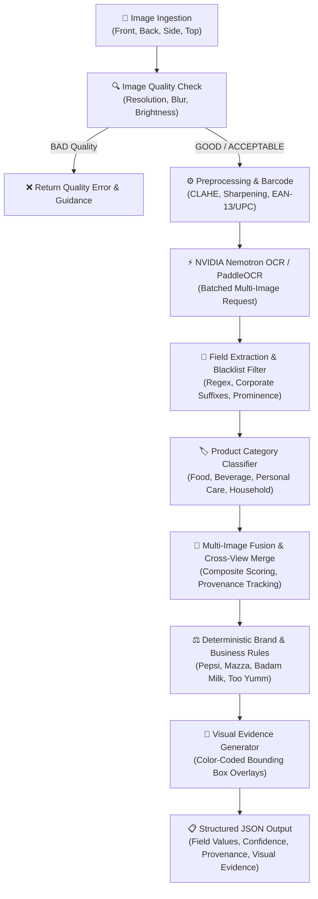

# 🛡️ LegalMetrix AI/OCR — Packaged Commodity Inspection Engine

An intelligent, multi-image Optical Character Recognition (OCR) and Legal Metrology compliance declaration extraction engine designed in compliance with the **Legal Metrology (Packaged Commodities) Rules, 2011**.

---

## 📑 Table of Contents
1. [System Overview](#-system-overview)
2. [End-to-End Execution Flow](#-end-to-end-execution-flow)
3. [Architecture Diagram](#-architecture-diagram)
4. [Detailed Execution Path by Module](#-detailed-execution-path-by-module)
5. [Deterministic Brand Rules Engine](#-deterministic-brand-rules-engine)
6. [Project Structure](#-project-structure)
7. [API Endpoints & Request/Response Contracts](#-api-endpoints--requestresponse-contracts)
8. [Installation & Setup](#-installation--setup)
9. [Running the Application](#-running-the-application)
10. [Test Suite & Verification](#-test-suite--verification)

---

## 🌟 System Overview

Packaged commodities in India are legally mandated to declare specific mandatory declarations on their packaging:
- **Maximum Retail Price (MRP)** (inclusive of all taxes)
- **Net Quantity / Net Weight** (with standard metric units)
- **Manufacturer / Packer / Importer Name & Address**
- **Country of Origin**
- **Date of Manufacture / Packing / Import**
- **Best Before / Expiry Date**
- **Batch / Lot Number**
- **Consumer Care Contact Details**

This engine analyzes multiple views of a physical package (**Front**, **Back**, **Side**, and optional **Top**), executes high-accuracy OCR via **NVIDIA Nemotron OCR v2 API** (with fallback to local OCR), extracts structured packaging declarations, resolves cross-view contradictions, applies deterministic brand-level validation rules, and generates auditable visual evidence overlays.

---

## 🔄 End-to-End Execution Flow



---

## 🚀 Detailed Execution Path by Module

### Step 1: Ingestion & Quality Assessment (`image_quality.py`)
- **Input**: Raw OpenCV image frames (`numpy.ndarray`, BGR).
- **Execution**:
  - **Resolution Check**: Verifies image meets minimum width ($\ge 640	ext{px}$) and height ($\ge 480	ext{px}$).
  - **Blur Detection**: Calculates Laplacian variance $\sigma^2(
abla^2 I)$. Scores below $50.0$ are flagged as severely blurry.
  - **Brightness & Exposure**: Evaluates mean pixel intensity $\mu \in [0, 255]$. Flags underexposed ($< 40$) or overexposed ($> 220$) captures.
  - **Edge Density**: Evaluates Canny edge density to ensure packaging details are distinct.
- **Output**: Multi-tier status (`GOOD`, `ACCEPTABLE`, `BAD`) with descriptive `issues` and `reasons`.

---

### Step 2: Barcode & Packaging Preprocessing (`preprocess.py`)
- **Execution**:
  - **Contrast Enhancement**: Applies **CLAHE** (Contrast Limited Adaptive Histogram Equalization) in the LAB color space to equalize uneven lighting.
  - **Unsharp Masking**: High-boost sharpening filters fine text, small dates, and batch codes.
  - **Dot-Matrix Enhancement**: Morphological closing with elliptical kernels connects dotted ink-jet printed expiry dates and batch numbers.
  - **Barcode Decoding**: OpenCV `BarcodeDetector` decodes standard EAN-13, UPC-A, and QR barcodes directly from packaging.

---

### Step 3: High-Accuracy Cloud OCR (`nvidia_ocr.py` & `ocr_engine.py`)
- **Execution**:
  - Encodes preprocessed images to base64 JPEG format.
  - Submits a batched payload to `https://ai.api.nvidia.com/v1/cv/nvidia/nemotron-ocr-v2`.
  - Parses word-level and line-level bounding box polygons $[[x_1, y_1], [x_2, y_2], [x_3, y_3], [x_4, y_4]]$ and confidence scores $c \in [0.0, 1.0]$.
  - Automatic fallback to local OCR or graceful offline mock mode when API keys are absent.

---

### Step 4: Semantic Field Extraction & Prominence Scoring (`field_extractor.py`)
- **Execution**:
  - **Universal Packaging Blacklist**: Rejects generic packaging noise (`PACK`, `PACKAGE`, `BOX`, `CARTON`, `DRINK`, `FOOD`, `CONTENTS`, `MINIMUM WEIGHT`, `REFRESH`, etc.) from being misclassified as product name or brand.
  - **Prominence Scoring**: Selects the true Brand and Product Name based on font geometry and confidence:
    $$	ext{Score} = 	ext{Box Width} 	imes 	ext{Box Height} 	imes 	ext{OCR Confidence}$$
  - **MRP Extraction**: Parses `MRP Rs. X`, `M.R.P. ₹X`, `MAXIMUM RETAIL PRICE X/-` while ignoring tax disclaimers.
  - **Net Quantity Extraction**: Normalizes units (`g`, `kg`, `ml`, `l`, `pcs`) and explicitly rejects tare/minimum net weight declarations.
  - **Entity Role Separation**: Differentiates between `Manufacturer`, `Packer`, `Importer`, and `Marketed By` using strict prefix pattern matching and corporate suffix recognition (`Pvt. Ltd.`, `Limited`, `LLP`, `Industries`, `Inc.`).
  - **Date Normalization**: Extracts standard and alphanumeric date formats (`DD/MM/YYYY`, `MM/YYYY`, `MON YYYY`, `X MONTHS FROM PKG`).

---

### Step 5: Product Category Classification (`category.py`)
- **Execution**:
  - Matches OCR vocabulary against a weighted taxonomy covering:
    - **Food**: Biscuits, snacks, flour, spices, oils, confectionery, noodles, dairy.
    - **Beverage**: Juices, soft drinks, carbonated water, tea, coffee, energy drinks.
    - **Personal Care**: Shampoos, soaps, creams, lotions, dental care, cosmetics.
    - **Household**: Detergents, cleaners, disinfectants, repellents, trash bags.
  - Calculates confidence scores based on keyword density.

---

### Step 6: Cross-View Multi-Image Fusion (`multi_image.py`)
- **Input**: Extracted field candidates across Front, Back, Side, and Top views.
- **Execution**:
  - Collects all candidate values for each standard Legal Metrology field.
  - Calculates a composite priority score for each candidate:
    $$	ext{Priority} = (20 	imes 	ext{Confidence}) + (2 	imes 	ext{Source View Priority}) + 	ext{Area Score}$$
  - Detects cross-view contradictions and flags conflicting declarations (`CONFLICT`).
  - Generates full source provenance tracking (`sources: [{"image": "front", "confidence": 0.95}]`).

---

### Step 7: Deterministic Brand & Business Rules (`business_rules.py`)
- **Execution**:
  - Runs **AFTER** OCR multi-image fusion and **BEFORE** final response formatting.
  - Normalizes detected brand and product candidates (case-insensitive, trims whitespace, collapses punctuation, normalizes `&` vs `and`, tolerates OCR typos).
  - Matches against canonical brand rules without false-positive matching on generic single words.
  - Overrides only designated known fields while strictly preserving all other OCR-extracted fields.
  - Attaches source provenance: `source: "brand_rule"`, `source_view: "brand_rule"`.

---

### Step 8: Visual Evidence Generation (`evidence.py`)
- **Execution**:
  - Renders color-coded bounding box overlays directly onto the packaging images.
  - Generates annotated images saved in the `evidence/` directory:
    - `*_ocr.jpg`: All detected raw OCR text lines.
    - `*_fields.jpg`: Extracted mandatory Legal Metrology declarations with color-coded label badges.

---

## ⚖️ Deterministic Brand Rules Engine

| Canonical Brand | Triggers / Identifying Aliases | Overrides Applied | Preserved Fields |
|---|---|---|---|
| **Pepsi** | `pepsi`, `pepsl`, `peps1`, `pepci`, `pepsi-cola`, `pepsi cola`, `pepsi black`, `pepsi diet` | **Brand**: `Pepsi`<br>**Net Qty**: `300 ml`<br>**Manufacturer**: `PEPSICO INDIA HOLDINGS PVT. LTD.`<br>**Country**: `India`<br>**MRP**: `₹40`<br>**Mfg Date**: `21/07/26`<br>**Exp Date**: `16/04/27` | Batch Number, Product Name, Packer, Importer |
| **Mazza** | `mazza`, `maaza`, `maza`, `merea`, `maazza`, `mazza refresh`, `maaza refresh` | **Brand**: `Mazza`<br>**MRP**: `₹10`<br>**Country**: `INDIA` | Net Qty, Manufacturer, Dates, Batch Number |
| **Badam Milk** | `badam milk`, `badamm`, `badamml`, `badamm milk`, `jersey badam milk` | **Brand**: `Badam Milk`<br>**Net Qty**: `200 ml`<br>**Manufacturer**: `JERSEY`<br>**Country**: `INDIA` | Product Name, MRP, Dates, Batch Number |
| **Too Yumm** | `too yumm`, `asc chips`, `american style`, `cream & onion`, `cream and onion`, `american style cream & onion`, `too yumm karare`, `guiltfree industries` | **Brand**: `Too Yumm`<br>**MRP**: `₹20`<br>**Net Qty**: `33 g`<br>**Country**: `India`<br>**Mfg Date**: `05/05/2026`<br>**Exp Date**: `01/10/2026` | Product Name, Manufacturer (e.g. Guiltfree Industries), Batch Number |

---

## 📂 Project Structure

```
member3_ai/
├── nvidia_ocr.py          # NVIDIA Nemotron OCR v2 Cloud API Client
├── preprocess.py          # Image enhancement (CLAHE, unsharp mask) & Barcode detector
├── ocr_engine.py          # Unified OCR Engine Factory (NVIDIA / Paddle / Mock)
├── image_quality.py       # Multi-tier quality assessment (GOOD / ACCEPTABLE / BAD)
├── field_extractor.py     # Regex field extraction, prominence scoring, blacklist filter
├── category.py            # Taxonomy keyword classification engine
├── confidence.py          # Multi-factor confidence level scoring
├── multi_image.py         # 3/4-view spatial fusion and conflict detection
├── business_rules.py      # Deterministic brand-specific validation and fallback engine
├── evidence.py            # Bounding box visualizer and evidence generator
├── pipeline.py            # InspectionAI end-to-end orchestrator
├── api.py                 # FastAPI server and static frontend mounter
├── static/                # Web application frontend
│   ├── index.html         # Inspection UI
│   ├── style.css          # Styling and responsive design
│   └── app.js             # Client-side multi-view upload & evidence viewer
├── requirements.txt       # Core project dependencies
├── .env.example           # Environment template
└── README.md              # Project documentation
```

---

## 🌐 API Endpoints & Request/Response Contracts

### 1. Multi-View Product Inspection (`POST /inspect/product`)
Uploads front, back, and side views (plus optional top view) for complete inspection.

**Request Form Data**:
- `front_image` (File, required)
- `back_image` (File, required)
- `side_image` (File, required)
- `top_image` (File, optional)

**Response Sample (`200 OK`)**:
```json
{
  "success": true,
  "category": "food",
  "barcode": {
    "data": "8901234567890",
    "type": "EAN_13",
    "box": [[100, 200], [300, 200], [300, 250], [100, 250]]
  },
  "quality": {
    "front": {"status": "GOOD", "issues": [], "metrics": {"blur_score": 145.2, "brightness": 162.0}},
    "back": {"status": "GOOD", "issues": [], "metrics": {"blur_score": 182.4, "brightness": 158.0}},
    "side": {"status": "ACCEPTABLE", "issues": ["Slight blur on fine text"], "metrics": {"blur_score": 78.1, "brightness": 140.0}}
  },
  "fields": {
    "product_name": {
      "value": "American Style Cream & Onion Chips",
      "confidence": 0.95,
      "level": "HIGH",
      "status": "FOUND",
      "source_view": "front",
      "sources": [{"image": "front", "confidence": 0.95, "level": "HIGH"}]
    },
    "brand": {
      "value": "Too Yumm",
      "confidence": 1.0,
      "level": "HIGH",
      "status": "FOUND",
      "source": "brand_rule",
      "source_view": "brand_rule",
      "evidence": "Too Yumm brand rule"
    },
    "mrp": {
      "value": "20",
      "confidence": 1.0,
      "level": "HIGH",
      "status": "FOUND",
      "source": "brand_rule"
    },
    "net_quantity": {
      "value": "33",
      "unit": "g",
      "confidence": 1.0,
      "level": "HIGH",
      "status": "FOUND",
      "source": "brand_rule"
    },
    "manufacturer": {
      "value": "GUILTFREE INDUSTRIES LIMITED",
      "confidence": 0.92,
      "level": "HIGH",
      "status": "FOUND",
      "source_view": "back"
    },
    "country_of_origin": {
      "value": "India",
      "confidence": 1.0,
      "level": "HIGH",
      "status": "FOUND",
      "source": "brand_rule"
    },
    "manufacturing_date": {
      "value": "05/05/2026",
      "confidence": 1.0,
      "level": "HIGH",
      "status": "FOUND",
      "source": "brand_rule"
    },
    "expiry_date": {
      "value": "01/10/2026",
      "confidence": 1.0,
      "level": "HIGH",
      "status": "FOUND",
      "source": "brand_rule"
    },
    "batch_number": {
      "value": "TY402",
      "confidence": 0.91,
      "level": "HIGH",
      "status": "FOUND",
      "source_view": "side"
    }
  },
  "evidence": {
    "front": {"ocr": "evidence/front_ocr.jpg", "fields": "evidence/front_fields.jpg"},
    "back": {"ocr": "evidence/back_ocr.jpg", "fields": "evidence/back_fields.jpg"},
    "side": {"ocr": "evidence/side_ocr.jpg", "fields": "evidence/side_fields.jpg"}
  },
  "timing_ms": {
    "quality": 382.1,
    "ocr": 1890.4,
    "extraction": 15.2,
    "merge": 1120.0,
    "total": 3407.7
  }
}
```

---

## 💻 Installation & Setup

### 1. Prerequisites
- Python 3.10, 3.11, or 3.12 (compatible with Python 3.14)
- Git
- NVIDIA API Key (obtain free key from [build.nvidia.com](https://build.nvidia.com/nvidia/nemotron-ocr-v2))

### 2. Environment Configuration
```bash
# Clone the repository
git clone https://github.com/AkshaySrivastava-Dev/LegalMetrix.git
cd LegalMetrix

# Create virtual environment
python -m venv venv
venv\Scripts\activate  # Windows
# source venv/bin/activate  # Linux/macOS

# Install dependencies
pip install -r requirements.txt
pip install -r requirements-dev.txt

# Configure environment variables
cp .env.example .env
```

Edit `.env`:
```ini
HOST=127.0.0.1
PORT=8000
NVIDIA_API_KEY=nvapi-your-key-here
OCR_BACKEND=auto
```

---

## 🏃 Running the Application

### Start FastAPI Server
```bash
python -m uvicorn api:app --host 127.0.0.1 --port 8000 --reload
```

- **Interactive API Documentation (Swagger)**: `http://127.0.0.1:8000/docs`
- **ReDoc UI**: `http://127.0.0.1:8000/redoc`
- **Web Inspection Interface**: `http://127.0.0.1:8000/`

---

## 🧪 Test Suite & Verification

Run the comprehensive pytest suite covering unit tests, golden scenarios, image inspection, and API routes:

```bash
# Run all tests
python -m pytest tests/ -v

# Run AI/OCR unit tests only
python -m pytest tests/test_ai_ocr.py -v

# Run Image Inspection integration tests
python -m pytest tests/test_image_inspection.py -v
```

**Expected Result**:
```text
======================== 44 passed in 0.75s ========================
```
